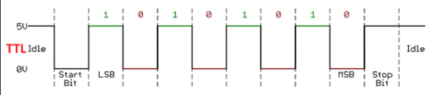

# Raspberry PI

## 串口


TX (GPIO14); RX (GPIO15)


### libgpiod 

#### 编译安装

```sh
# get from github
git clone https://github.com/brgl/libgpiod

# install build dependencies
sudo apt install autoconf autoconf-archive libtool

# build 
cd libgpiod && mkdir m4
./autogen.sh --enable-tools=yes
make
sudo make install

# install lib
sudo apt install libgpiod-dev
```


### 串口连接测试

#### 环境 
- Ubuntu 18.04

#### 测试 

发送端  
[测试代码](https://github.com/Lavender-Tree/robot/blob/master/raspberrypi/serial_comm.c)

接收端  
```sh
gpiomon gpiochip0 15
```

测试结果
> baud: 9600  
> send: `10101010`

> recv:  
event: FALLING EDGE offset: 15 timestamp: [1573795953.033535438]  
event:  RISING EDGE offset: 15 timestamp: [1573795953.033720381]  
event: FALLING EDGE offset: 15 timestamp: [1573795953.033834597]  
event:  RISING EDGE offset: 15 timestamp: [1573795953.033936365]  
event: FALLING EDGE offset: 15 timestamp: [1573795953.034036831]  
event:  RISING EDGE offset: 15 timestamp: [1573795953.034166724]  
event: FALLING EDGE offset: 15 timestamp: [1573795953.034272502]  
event:  RISING EDGE offset: 15 timestamp: [1573795953.034345313]  


  


## 参考文档
1. [GPIO](https://www.raspberrypi.org/documentation/usage/gpio/README.md)
2. [elinux](https://www.elinux.org/Main_Page)
3. [RPI Serial Connection](https://www.elinux.org/RPi_Serial_Connectio)
4. [UART RS232 TTL ](https://zhuanlan.zhihu.com/p/25893717)

